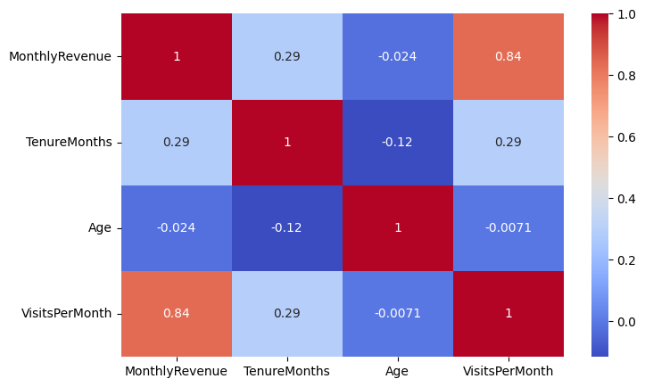
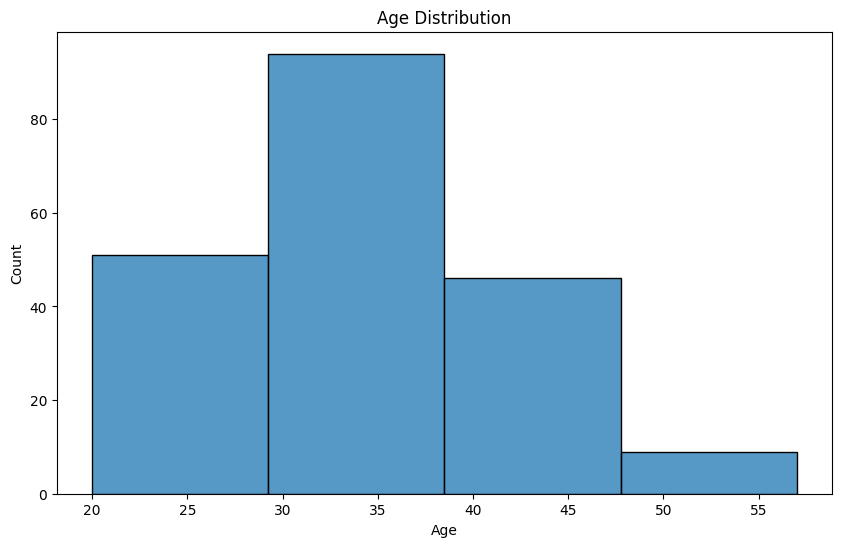
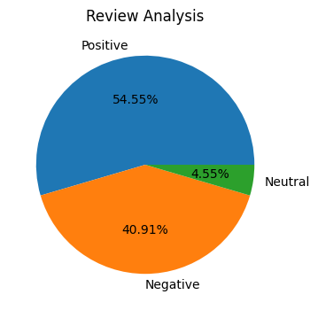

# 🛍️ Retail Customer Segmentation — EDA


Exploratory data analysis on retail customer data to uncover what actually drives revenue — and challenge some assumptions along the way.

---

## 📌 Table of Contents
- [Overview](#overview)
- [Tech Stack](#tech-stack)
- [Dataset](#dataset)
- [Approach](#approach)
- [Key Insights](#key-insights)
- [Sample Output](#sample-output)
- [How to Run](#how-to-run)
- [Project Structure](#project-structure)
- [Future Improvements](#future-improvements)
- [Author](#author)

---

## Overview
This project explores retail customer data to understand what actually drives monthly revenue — testing common assumptions like "higher city tier = higher spend" and "gender affects purchasing behavior" against the actual data.

## Tech Stack
| Category | Tools |
|---|---|
| Language | Python |
| Data Handling | pandas, numpy |
| Visualization | matplotlib, seaborn |
| Environment | Google Colab / Jupyter Notebook |

## Dataset
| Detail | Value |
|---|---|
| Rows | 200 customers |
| Features | 9 |
| Key features | Age, Gender, City Tier, Visits Per Month, Monthly Revenue, Tenure |

## Approach
1. **Data Cleaning** — handled missing values and verified data types across all features
2. **Univariate Analysis** — distribution of age, revenue, and visit frequency
3. **Categorical Breakdown** — gender and city tier segmentation
4. **Correlation Analysis** — heatmap across numeric features to identify what actually predicts revenue

## Key Insights
- 📈 **Visits Per Month ↔ Monthly Revenue**: **0.84 correlation** — the strongest relationship in the dataset. Customer visit frequency is a far stronger revenue predictor than demographic factors
- 🏙️ **City Tier 3 customers outperform higher tiers** in average revenue — challenging the assumption that "Tier 1 cities" automatically mean higher-value customers
- ⚖️ **Gender has minimal impact on spend** — purchasing behavior is largely gender-neutral in this dataset, reinforcing that engagement frequency matters far more than demographic segmentation

## Sample Output

**Correlation Heatmap**


**Customer Distribution**


**Category Breakdown**


## How to Run

```bash
# 1. Clone the repository
git clone https://github.com/LAXMI15PRIYA/retail-customer-segmentation-eda.git
cd retail-customer-segmentation-eda

# 2. Install dependencies
pip install pandas numpy matplotlib seaborn

# 3. Launch the notebook
jupyter notebook Retail_Customer_Segmentation_EDA.ipynb
```

Alternatively, open the notebook directly in Google Colab for zero local setup.

## Project Structure

retail-customer-segmentation-eda/
├── retail_customer_data.csv               # Raw customer dataset
├── Retail_Customer_Segmentation_EDA.ipynb  # Main EDA notebook
├── Heatmap.png                             # Correlation heatmap
├── BarChart.png                            # Customer distribution chart
├── piechart.png                            # Category breakdown chart
├── README.md
└── LICENSE
## Future Improvements
- [ ] Build customer segments using K-Means clustering on revenue and visit frequency
- [ ] Analyze tenure's relationship with customer lifetime value
- [ ] Investigate why Tier 3 outperforms other tiers — possible confounding variables worth exploring
- [ ] Build a revenue prediction model using visit frequency as the primary feature

## Author
**Lakshmi**
M.Tech AI & Data Science | Aspiring Data Analyst / AI Engineer
🔗 [GitHub](https://github.com/LAXMI15PRIYA)

---
⭐ If you found this project useful, consider giving it a star!
